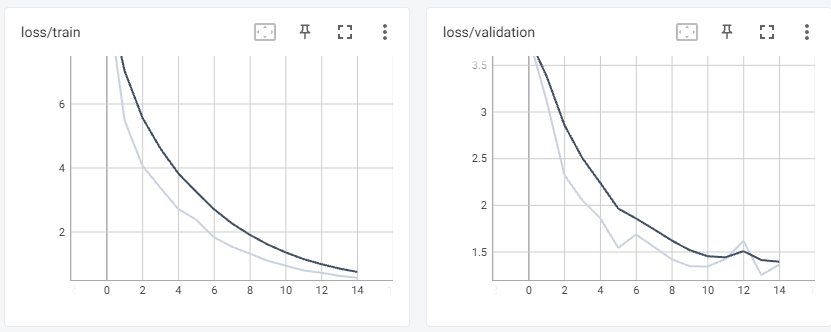
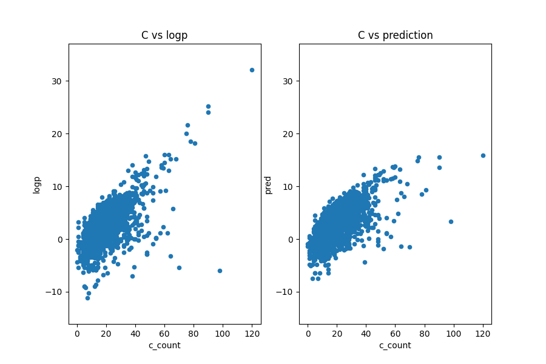
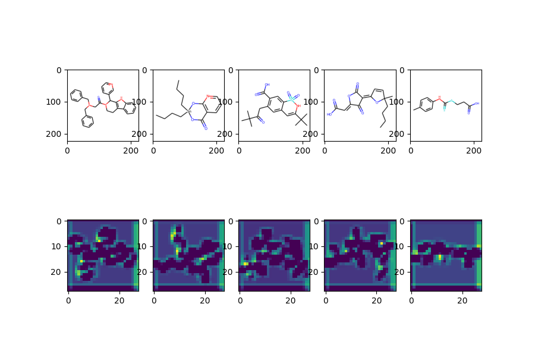

# image-logp
## ENVIRONMENT
- wsl2 ubuntu 20.04
- python 3.6.15

## INSTALL
```bash
pip install -r requirements.txt
```

## result
- loss
    
- carbon number vs logp
    
- layer visualization
    

## 解説記事
qiita : https://qiita.com/hiroya_kubo/items/479f703898eb23de0d84